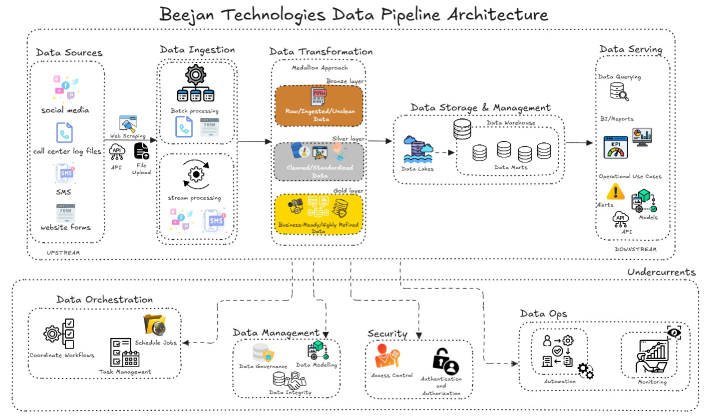

## Beejan Technologies Data Engineering Project

## End-to-End Data Pipeline

<em>Data Pipeline</em>

[*Link to Architecture*](https://excalidraw.com/#json=RVlYGQOwumN0P9CX8LB2b,Bi5lSTVtqqq2WfeysYMGAA)

## Design Choices

Firstly, by understanding domain knowledege, Telecom industry is one of the industry that generates a large volume of data amongst other industries like financial industry, automobile industry etc; from customer interactions, network logs, billing systems, and social channels. This makes a robust data engineering pipeline a necessity for timely insights and regulation compliance for **Beejan Technologies**.

## Data Ingestion

Starting with the data Ingestion, the process adopted in the architecture is the **hybrid (lambda-style) processing** (i.e combination of real-time and batch processing), and the reason behind this is because social media and sms generated-data requires more urgency or feedback than log files or website forms which may be near real-time or batch depending on the source system design.

These data sources like website forms, call center log files may be ingested via file uploads or connection to the backend database where it is being stored, while data from the social media is most likely gotten via the media's public api or by scraping the web page.

Also, this hybrid approach allows scalability without over-engineering and enables the company to swing into action in real time to urgent issues (SMS, social media) while also cost-optimizing batch ingestion for less urgent sources (logs, forms).

## Data Transformation

After this ingestion, the _Medallion approach_ is used in the Data Transformation stage to allow separation of concern at each level in which the data is being transformed

- **Bronze-layer Data**: This contains data from the ingestion stage, which is data in its raw/unclean form, with minimal or no transformation at all.

- **Silver-layer Data**: This contains data that have been cleaned, standardized and enriched by removing duplicates, fixing missing values, unifying data formats, adding metadata etc.

- **Gold-layer Data**: Here, the data have been curated, highly-refined and serve as a single-source-of-truth for the business, with different actions like aggregations, classifications of complaints (either by priority, risk level, reoccurence etc.) taking place

This _Medallion approach_ makes data validation at every point easy, as you can validate each layer against the previous layer as transformation is being applied to avoid any form of data loss. 

Also, for future use-case when another business need may arise that was not captured in the present problem statement, the bronze layer can save the day!

## Data Storage and Management

At each stage of the transformation, the data is stored and managed in a storage system, for the:

- **Bronze-layer Storage**: This can be called the staging-level, the data is stored in a data lake, with various data format like JSON, CSV, logs, Parquet etc.

- **Silver-layer Storage**: The data from this transformation can either be stored in a data lake or data warehouse depending on the business use case.

- **Gold-layer Storage**: This business-ready data is stored in a data warehouse that serves as the centralised repository, from which different data marts can be derived based on the use case. The data format for this is structured tables.

## Data Serving

After the final layer is being stored in the data warehouse, accessible, reliable and efficient data is being served to different downstream users for different purposes like data querying, analysis/reporting, operations (alerts, models, api for other business use case etc.)

The _ETL process was best preferred over the ELT_ in this Data Pipeline Architecture, because unlike ELT which works best when data is mostly structured or the data warehouse has a very strong in-built transformation engine; the data sources consists of structured, unstructured and semi-structured data variety and ETL has an edge in cleaning and standardizing heterogeneous data before loading, handling complex transformations outside of the warehouse, ensuring high-quality compliant data reaches the storage layer and keeping the warehouse optimized for downstream users

Also, ETL ensures sensitive telecom customer data (names, phone numbers, IDs) can be anonymized or masked before loading into the warehouse, which helps to reduce security and compliance risk, which is a big deal in telecom.

## Undercurrents

In this architecture, the **DATA ENGINEERING LIFE CYCLE** standard was adopted, inclusive of undercurrents like:

- **Data Orchestration**: To ensure that the dependency of each task is well implemented.

- **Security**: For access control and ensure no data or system breach occurs

- **DataOps**: To ensure automation, observability and monitoring of the data as it moves from source to destination and operations for optimization purpose.

- **Data Management**: This ensures for accountability, data integrity and compliance with telecom regulations.

## Asuumptions/Thoughts

1. I have API as a channel for ingestion with the assumption that the social media compalints data/information will be gotten from the public api of these social media channels, else web scraping will be used.

2. I assumed that the data from the log files and website forms are accessible or made available at an interval e.g daily, hourly ect., hence the reason for batch processing.

## Challenges/Unknwown

1. **Data Uncertainty**: The velocity (speed),volume (size) and Frequency (daily or month etc.) of the data generated (complaints) were not specified, which have a major role to play in architecture design and cost management. What is only known is that "Every day, thousands of customers complain about issues" and a customer is likely to have more than one complaints in a day based on the uirgency. Afterall, they have fragmented systems so they might not be able to provide this and I am sure this is one of the problems my data pipeline will solve, as they will be able to track the average complaints from each data soiurce in a day,week,month,quarter,year etc. 

2. **Data Variety**: Dealing with different data types (structured, semi-structured, unstructured) especially the data that will be collected from the SMS data source and social media (provided an API is not provided and web scraping is being used), which will be most likely an unstructured data.
So, I broke it down this way:
- **Social Media**: API; Semi-structured (JSON), Web-scaping; Unstructured
- **Call Center Log Files**: Structured CSV/Logs
- **SMS**: Structured
- **Website Forms**: Structured

3. **Tradeoffs**: Another envisaged challenge is deciding between real-time/streaming processing and batch processing since the velocity was not stated, it was just assumed that social media and SMS feedback can signal urgent issues and might requiring immediate action, unlike Call center log files and Website forms which maybe exported at the end of the day depending on the source system design.

4. **Project Constraints**: Also, the project manager did not communicate the duration of the project, but from variouse statements like: "Every day, thousands of customers complain about issues", "The management is frustrated", this pipeline will drastically reduce reporting delays from days/weeks to near real-time, enabling quick decision-making like detecting network outages faster, reducing customer churn by responding to complaints as soon as possible etc.

## Other Information:
The architecture is designed to _scale horizontally_ (distributes workload across multiple machines) so that as complaint volume or users grows (from let's say thousands per day to millions per day),data ingestion and transformation can scale independently and ensuring fault tolerance without negatively impacting downstream users or causing the system to break/crash, unlike the _vertical scaling_ that adds more CPU/RAM to a single machine.

